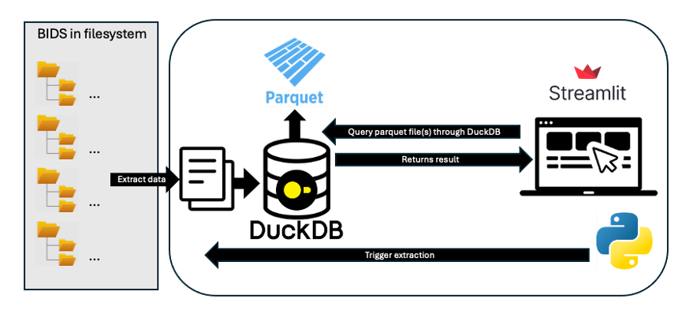

# How to install locally:

Python 3.9 or higher is needed and should be installed: http://python.org/downloads/

This is how you install the app locally:

1. Download this repo to your computer (Windows, iOS or Linux)
2. In the folder, locate install.sh and in a console run:
3. ```./install.sh```

# Architecture


# Project organization (as of February 2025):
## data:
The data folder is used for the folders that will contain the generated parquet files, as well as the intermediary csv files.

2 folders are created inside it either when running install.sh locally or when the app is built for the HIP:

## csv_files
parquet_files
The folder parquet_files on the HIP also get a symbolic link to a folder of the same name created in app_data/bidssearchtool which will make the data persistent (saved in between restarts of the app container).

## sample
The sample folder contains dummy dataset metadata. It is used for demo purposes if no datasets are available.

## src
The folder that contains all the source code for the app. At the root there are scripts and files that handle configuration, and the start.py script that is used to launch the streamlit app.

- **app:** All the streamlit application related scripts. In the subfolder pages there are the pages to which the user can navigate. Note: the page 6_dataset_search_demo.py is hidden and not used in v1.0.0 but can be used as example for an interface allowing to browse through many datasets.
- **bids_extraction:** All scripts related to the extraction of BIDS metadata
- **db:** Has only one script that defines a singleton for duckdb and its connections.
- **queries:** All scripts defining the used queries. Query_helper.py contains some drafts of methods to generalize the query → UI filter → query process without pre-defined filters.
- _Configuration.py:_ handles reading and writing into configuration files (user_config.yaml, config.yaml is not used). user_config.yaml has a symbolic link to home/$user/app_data/bidssearchtool/config/user_config.yaml in order to keep changes to the configuration in between runs of the app container.

# Known issues:
The modality specific query methods fetch_sessions_by_criteria in both ieeg_data_queries and eeg_data_queries are very long already and handling of missing columns has not been added. This and the equivalent for the participants query can be improved by generalizing the code so that it scales better. 
